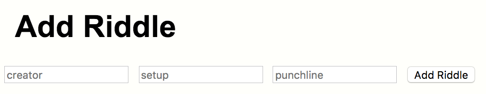
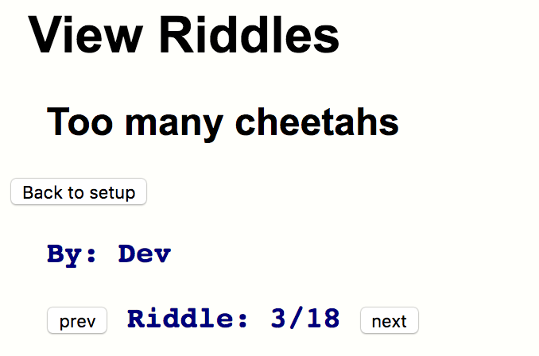

The MEAN Riddler
===
---

Manny riddles have evaporated andbeen lost to the ether. Our client wants to remedy that situation with a MEAN stack web app.

The app will have 2 views:

- add riddle
- view riddles 

Add Riddle view
---

The application that you'll be creating will take in the following input:

- riddle creator
- setup
- punchline

This should then be stored in a Mongo database alongside other riddles:

View Riddles view
---

When in the View Riddles view, riddles are shown one at a time with the creator always displayed. With the setup shown first. A button toggles between the setup and punchline. 

The user should be able to move forward/backward through the riddles as well.  

Hard mode:
---

Add some styling and feedback. For instance, confirm when a riddle is added and/or change the style of how setups/punchlines are displayed.

Pro mode:
---

Add the ability to view riddles by creator. That is, a new interface that shows all creators, allows the user to select one, then only shows jokes by that creator. 

The ability to view all riddles should be the default behavior of the app.